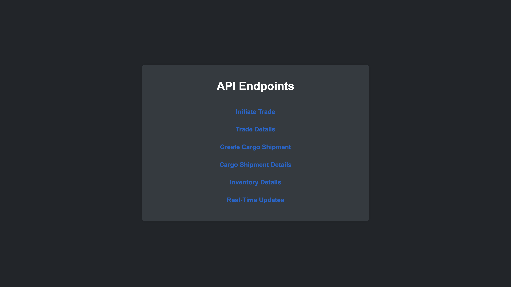

# Intergalactic Trade Network

The Intergalactic Trade Network is a highly scalable backend system designed to handle trade transactions, manage space cargo, and track space station inventory across multiple planets and space stations. 

This system is built using `Django`, `PostgreSQL`, and `JWT` for authentication, ensuring secure and efficient processing of high-throughput data while providing real-time updates on trade activities.

Check out the
<a href="https://13.61.4.132:8000/api">
live demo:

</a>

## Table of Contents

<details>
<summary>Click to expand</summary>

- [Intergalactic Trade Network](#intergalactic-trade-network)
  - [Table of Contents](#table-of-contents)
  - [Design Decisions and Architectural Choices](#design-decisions-and-architectural-choices)
    - [High-Level Architecture](#high-level-architecture)
  - [Setup Instructions](#setup-instructions)
    - [Prerequisites](#prerequisites)
    - [Installation](#installation)
  - [Instructions for Testing APIs and Real-Time Features](#instructions-for-testing-apis-and-real-time-features)
    - [API Testing](#api-testing)
  - [Known Limitations and Potential Improvements](#known-limitations-and-potential-improvements)
  - [Scaling Strategies](#scaling-strategies)
</details>

## Design Decisions and Architectural Choices

### High-Level Architecture

- **Modular Design:** The system is divided into distinct modules for managing trades, cargo, and inventory. Each module operates independently but can interact with others through well-defined APIs.
- **API Gateway:** An API gateway handles routing of requests to appropriate services, authentication via JWT, and provides a single entry point for all client interactions.
- **Asynchronous Processing:** Message queues are used for handling time-consuming tasks such as cargo shipment processing, enabling the system to remain responsive under heavy load.
- **Database:** PostgreSQL is used as the primary database due to its robustness, scalability, and support for complex queries. The database schema is optimized for high-throughput data ingestion and efficient querying.

## Setup Instructions

### Prerequisites

- Python 3.10.11
- Django 5.1
- PostgreSQL 16.4

### Installation

1. **Clone the Repository:**
    ```bash
    git clone https://github.com/iABn0rma1/intergalactic_trade_network.git
    cd intergalactic_trade_network
    ```

2. **Set Up Virtual Environment:**
    ```bash
    python3 -m venv venv
    source venv/bin/activate
    ```

3. **Install Dependencies:**
    ```bash
    pip install -r requirements.txt
    ```

4. **Configure Database:**
    - Update `settings.py` with your PostgreSQL database credentials.

5. **Run Migrations:**
    ```bash
    python manage.py migrate
    ```

6. **Start the Development Server:**
    ```bash
    python manage.py runserver
    ```

## Instructions for Testing APIs and Real-Time Features

### API Testing

- **Trades:**
    - `POST /api/trades`: Initiates a new trade transaction.
    - `GET /api/trades/{transactionId}`: Retrieves details of a trade transaction.
- **Cargo:**
    - `POST /api/cargo`: Creates a new cargo shipment.
    - `GET /api/cargo/{shipmentId}`: Retrieves cargo shipment details.
- **Inventory:**
    - `GET /api/inventory/{stationId}`: Retrieves inventory levels for a specific space station.
- **Real-Time Updates:**
    - `GET /api/updates/real-time`: Retrieves real-time updates on trade and cargo status.

## Known Limitations and Potential Improvements

- **Scaling Database:** Current implementation is optimized for small to medium datasets.
- **Rate Limiting:** Currently, rate limiting is not implemented. This should be added to prevent abuse of the API.
- **Improved Caching:** Caching strategies can be further refined to reduce latency, particularly for frequently accessed endpoints.
- **Enhanced Security:** Additional security measures such as IP whitelisting, encryption at rest, and more access controls.

## Scaling Strategies

- **Latency Reduction:**
  - In-Memory Caching: Redis or Memcached for quick data retrieval.
  - HTTP Caching: Implement caching headers to reduce load on the server.
  - Message queues for non-blocking operations.
  - Clustered, non-clustered, and partial indexes to optimize query performance.
- **Data Optimization:**
  - Horizontal and vertical partitioning strategies to distribute data.
  - Read replicas to handle read-intensive operations.
  - Offload historical data to a specialized data warehouse.
  - Application and database load balancing to distribute the load evenly.
  - Auto-scaling groups to dynamically adjust the number of instances based on demand.
